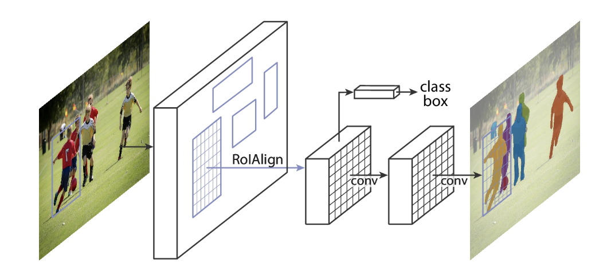
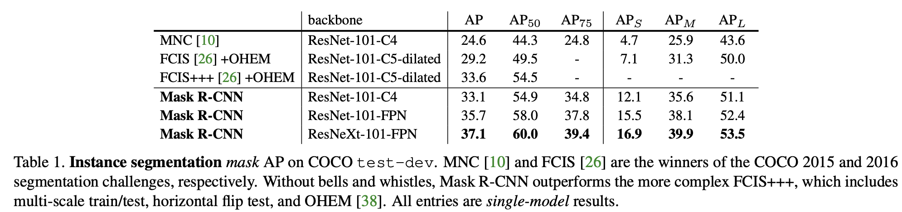
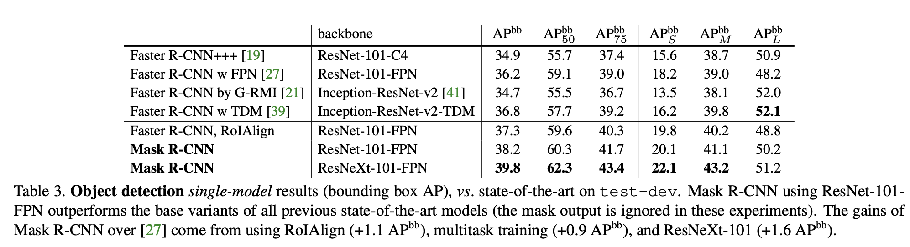
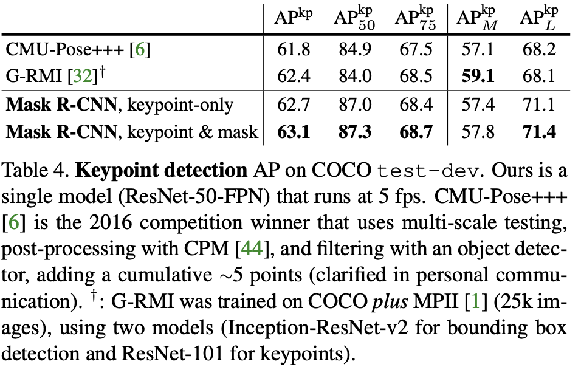
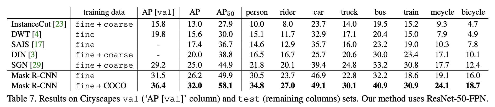
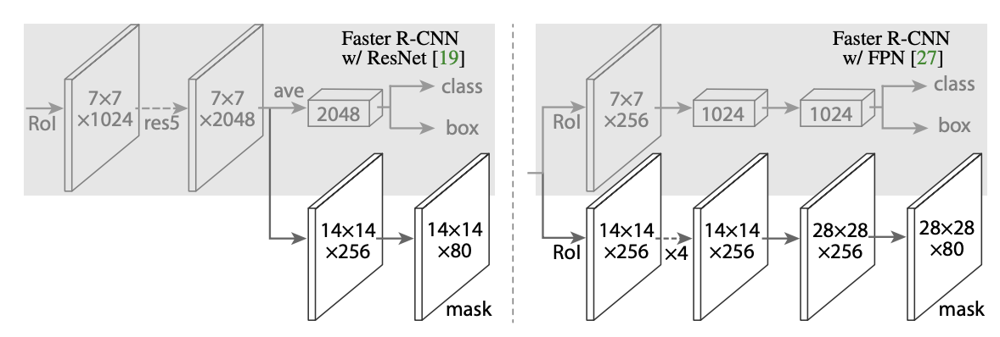
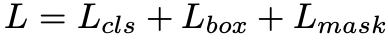
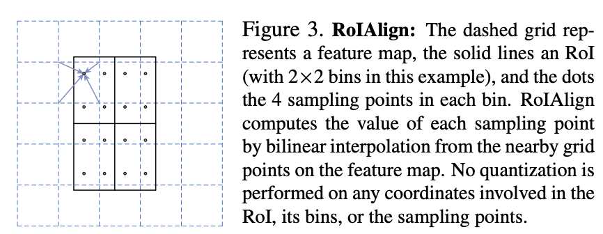

## Mask R-CNN
[paper](ttps://arxiv.org/pdf/1703.06870.pdf)  
[code](https://github.com/facebookresearch/maskrcnn-benchmark)  

---
### STRUCTURE

---
### Experimental Results
* COCO test-dev (Instance segmentation)  
  
* COCO test-dev (Object Dection)  
  
* COCO test-dev (Keypoint Dection)  
  
* Cityscapes val  

---
### Algorithm
* Mask分支  
相对于Faster RCNN，增加了mask分支用于实例分割  
  
mask层的输出接sigmod并用0.5的阈值将输出二值化后使用二进制交叉熵定义损失函数  
  
其中只用类别和检测框的损失计算和Fast RCNN一致，同样只将满足检测正样本条件的样本训练计入计算  
* ROI Align  
论文中探讨了Fast RCNN中的ROI Pool计算方式导致了像素偏移，不利于后续的检测以及掩码分支  
Roi pooling一共做了两次量化，导致像素偏移：  
1.通过RPN得到proposal后实际上是一个float（regress结果），但是将其映射到feature map后有一个取整操作  
2.ROi pooling的过程中，将Roi几等分，这个时候可能出现除不尽的情况，例如feature map为30x30，而Roi为7x7，这个时候就有取整  
于是提出了ROI Align来修正偏移  
  
1.proposal 映射到 roi时，保留浮点数  
2.进行与roi pooling一样的等分规则，此时依然保留浮点数  
3.将候选区域划分为KxK个区域，然后每个区域选出固定四个位置的feature点（坐标是float），然后每一个feature点，使用最近的4个真实feature点（整数），进行双线性插值，获得估计值，最后使用这四个点做max pooling得到最终每个区域的特征值（KxK）

---
### Intuition
基于Fast RCNN的检测框架引入了实例分割，且增加了整体性能，以及ROI对齐的提出使得网络在数值分析上更加的严谨，
Mask RCNN是一个阶段性成果，为实例分割奠定了后续在两阶段网络上的发展基础。