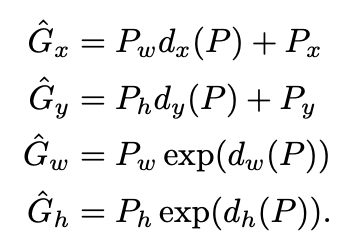

## RCNN
[paper](https://arxiv.org/abs/1311.2524.pdf)  
[code](http://www.cs.berkeley.edu/˜rbg/rcnn)  

---
### STRUCTURE

---
### Experimental Results
* VOC 2010 test (Detection)  
  
* ILSVRC2013 detection test set (Detection)  
  
* VOC 2007 test (Detection)  
  
* VOC 2011 test (Segmentation)  

---
### Algorithm
* 三阶段流程  
CNN网络主要作为一个特征提取器，提议框提取和分类阶段都是独立的，
这也导致了在test阶段每个提议框都要经过网络从而产生了大量的重复计算。  
1.find region proposal  
基于selective search算法，选择2K个region  
2.calc feature map  
训练阶段：使用region进行分类训练，实现网络的fine tuning  
测试阶段：将region reshape（anisotropic image scaling）到相同的尺寸，然后输入到CNN中得到固定尺寸的feature vector  
3.classification  
通过SVM进行分类并通过每个类别使用NMS去除重叠目标  
* 边界框回归  
为了进一步提高检测框的精度，论文提出输出再接一个做边界框回归的分支来修正ss的提议框。  
  
回归目标是修正提议框尽可能的接近真实框  
  
因此也可以得到目标方程：  
  
其中为网络的直接输出  
论文定义了回归值x, y, w, h的编解码过程：  
  
所以在训练阶段也需要对目标值进行编码：  
  
在测试阶段就将网络的输出通过解码得到真实位置G。

---
### Intuition
RCNN是第一个可以真正可以工业级应用的解决方案,改变了目标检测领域的主要研究思路
为后续的Fast R-CNN ，Faster R-CNN、Mask R-CNN奠定了网络设计的优化基点。