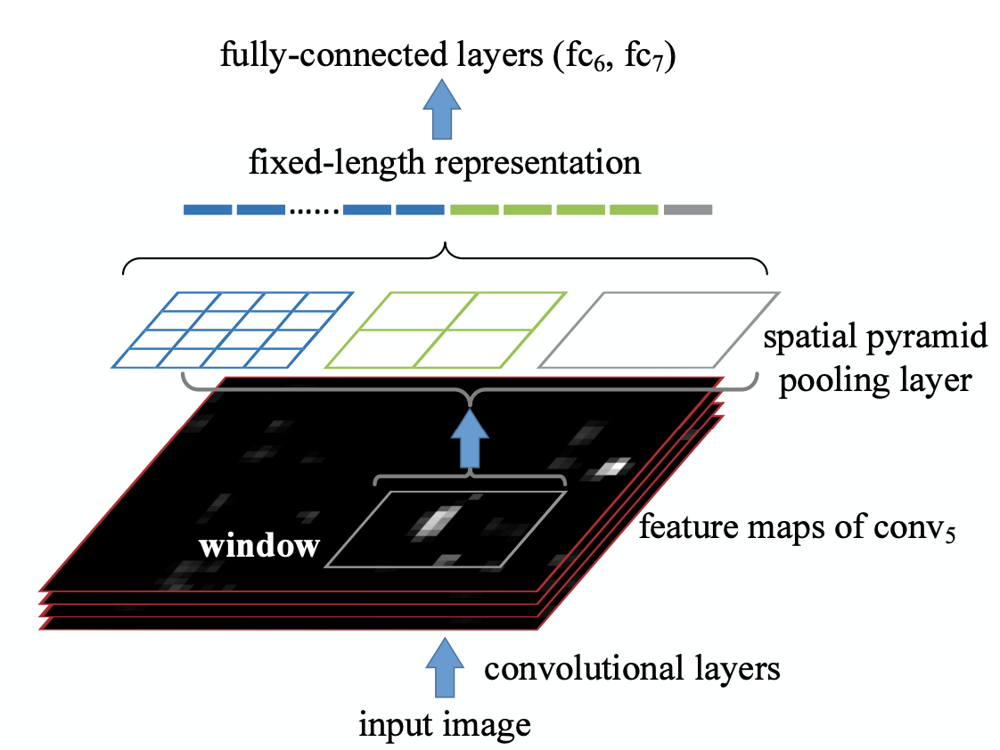

## Spatial Pyramid Pooling in Deep Convolutional Networks for Visual Recognition
[paper](https://arxiv.org/pdf/1406.4729.pdf)  
[code](http://research.microsoft.com/en-us/um/people/kahe/)  

---
### STRUCTURE

---
### Experimental Results
* ImageNet2012(Classification)  
  
* Pascal VOC 2017(Classification)  
  
* Pascal VOC 2017(Detection)  

---
### Algorithm
* 空间金字塔池化层  
卷积层与全连接层之间添加空间金字塔池化层，将任意尺寸的特征图转换为固定尺寸的特征图，从而解决网络对输入尺寸敏感的问题。  
对于nxn块的金字塔级，我们实现一个滑窗池化过程，窗口大小为win = 上取整[a/n]，步幅str = 下取整[a/n]. 
对于l层金字塔，我们实现l个这样的层。然后将l个层的输出进行连接输出给全连接层。
下图展示了一个cuda卷积网络风格的3层金字塔的样例，(3×3, 2×2, 1×1)。  
  
* 多尺寸训练  
由于不同尺度的输入只需要适配金字塔池化层的窗口大小个步幅，所以对其他的卷积层以及最后的全连接层的权重是无影响的。
在训练阶段也就可以实现多尺度的训练，结果证明多尺度的训练得到了性能上的提升。  
  
* 用于物体检测  
  
 不同于RCNN需要将提议框分别输入到CNN网络中，SPP-Net先对整图CNN然后再截取敏感区域做空间金字塔池化。  
这样的网络结构节省将每个ROI区域分别输入到的CNN的重复操作。

---
### Intuition
从网络结构上提出了空间金字塔结构解决网络对尺寸敏感的问题，并且减小了RCNN网络中大量的CNN重复计算。