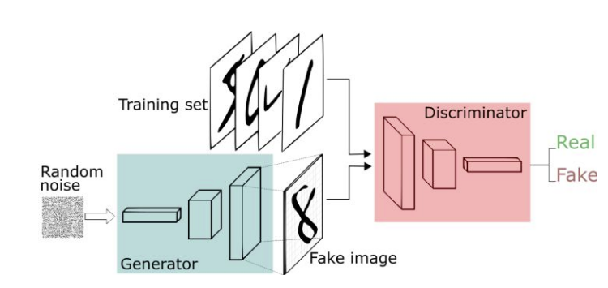
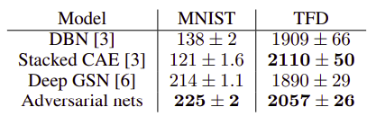
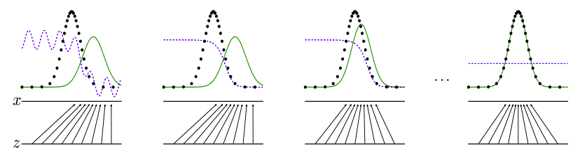
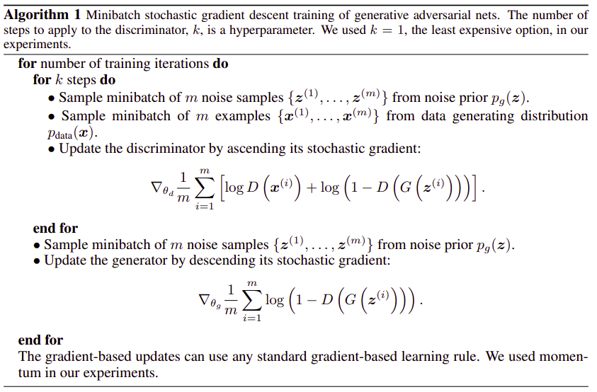

## Generative Adversarial Nets
[paper](https://arxiv.org/pdf/1406.2661.pdf)  
[code](http://www.github.com/goodfeli/adversarial)  
---
### STRUCTURE

---
### Experimental Results

---
### Algorithm  
* 博弈  
  
生成器和判别器的博弈，使得生成器生成符合真实样本分布的样本，
判别器的学习能力应当大于生成器，才能正常产生上图的几个阶段。  
* 迭代方式  
  
优先优化判别器，再优化生成器欺骗上一代判别器
---
### Intuition  
GAN网路的实质是生成器生成满足分布的数据，判别器作为辅助网络优化生成器。  
生成器可以看作是将高级特征还原为原始图像特征，其中噪声输入可以视为一种高级特征的分布，
将生成高级特征和该噪声最相近的原始图像。