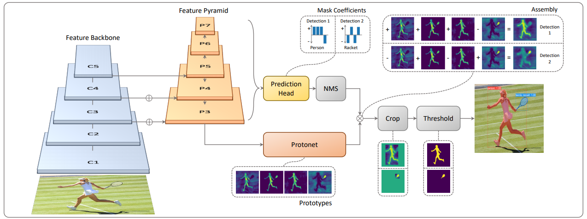
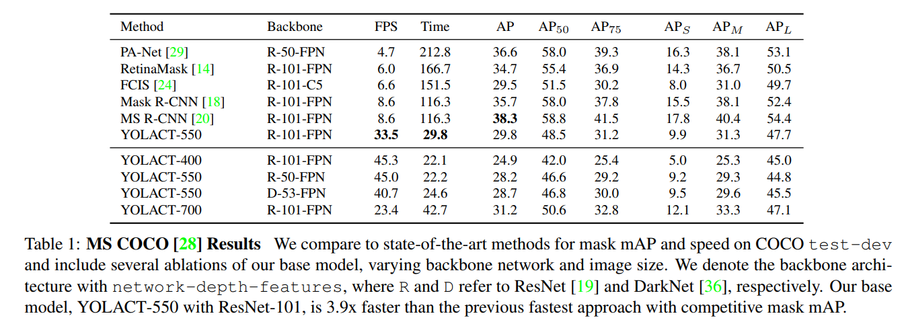
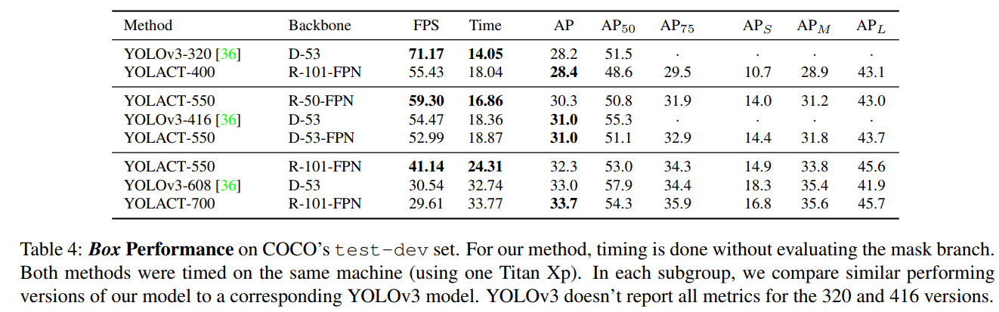
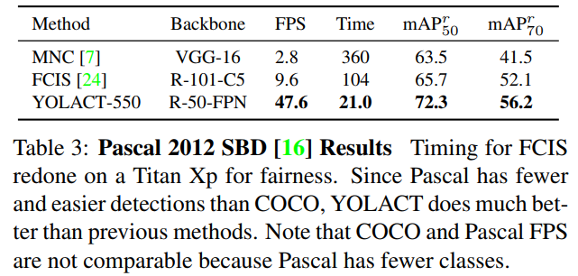
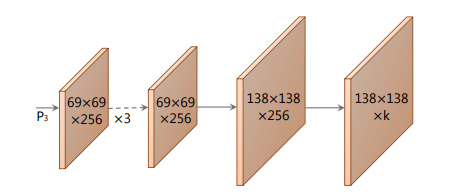
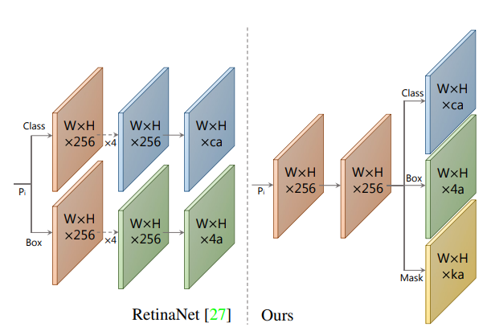
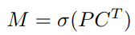
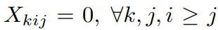
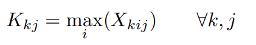
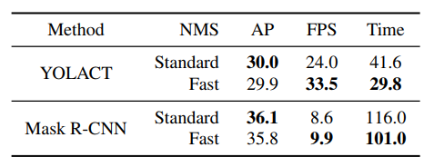

## Yolact
[paper](https://arxiv.org/pdf/1904.02689.pdf)  
[code](https://github.com/dbolya/yolact)  

---
### STRUCTURE
  

---
### Experimental Results  
* COCO test-dev  
  

* Pascal 2012 SBD  
  

---
### Algorithm  
* Prototype Generation and Mask Coefficients(生成原型掩模和掩模系数)  
Faster R-CNN的实例分割实现要先解决定位的问题，保留特征的空间相干性然后再通过mask层生成掩模。
这样的做法需要等待第一阶段的RPN输出提议框，这也导致增加了计算时间。  
Yolact通过将问题分解为两个并行的部分来独立计算最后将任务组合来解决问题。  
第一个分支生成prototype masks（原型掩模），第二个分支预测用来组合第一个分支生成的原型掩模的掩模系数。
最后将其作用的NMS后存活的每个实例上以形成每个实例的掩模。  
1.生成原型掩模（protonet）  
  
再主干网络的P3输出作为protonet的输入，利用卷积层擅长产生空间相干掩模，获得k个原型掩模。  
2.掩模系数(Head)  
  
Head层不仅仅产生掩模系数，还产生类别和预测框。所以一共存在三个分支，一个分支预测c类置信度，
一个分支用于预测4个边界框回归量，一个分支来预测k个掩模系数。  
3.生成实例掩模  
将prototype 分支和掩模系数分支的工作结合起来，使用前者与后者的线性组合作为系数。  
  
最后通过sigmod产生最终的掩模。  
* 损失函数  
整个网络使用三个损失函数：分类损失L(cls)，框回归损失L(box)，掩模损失L(mask)，掩模损失采用像素级的二进制交叉熵。  
* Fast NMS  
将NMS的计算矢量化，使其可以更好的再GPU上进行计算。  
1.对每个类别的前n个得分检测器计算一个大小为c x n x n的IOU矩阵X，并且按每个类别的分数降序排序。
此时得到的矩阵是一个对角阵。  
2.检查是否存在任何与得分较高的框的IOU大于某个阈值的框，从而找到需要删除的框。具体操作流程为：  
将下三角和对角线区域设置为0。  
  
保留列方向上的最大值获得每个预测框的最大IOU矩阵K。  
  
最后利用阈值t(K < t)来处理矩阵，对每个类别保留最优的检测器。  
整个流程就是首先保留置信度最高的框，然后计算其他框与该框的IOU是否大于阈值，超过则丢弃。  
Fast NMS比传统NMS的CUDA实现快16.5ms,但是在精度上只有很小的损失。  

---
### Intuition  
Yolact致敬YOLO，志在将实例分割做到实时处理。
其网络训练会将实例掩模做到本地实例化，并且学习相同类别的不同实例个体，且高阶特征表现的是整体特征，
这样才能通过掩模参数的线性组合出单个实例掩模。
掩模原型也是可压缩的，因为在掩模数量小于实例个数的时候任然可以将多个原型合并出多个实例。
将检测中一阶段的思想应用到实例分割上，这肯定是一个趋势和大的研究方向，论文将作为一阶段实例分割一个好的开始