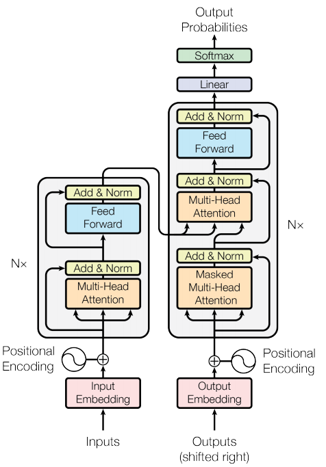
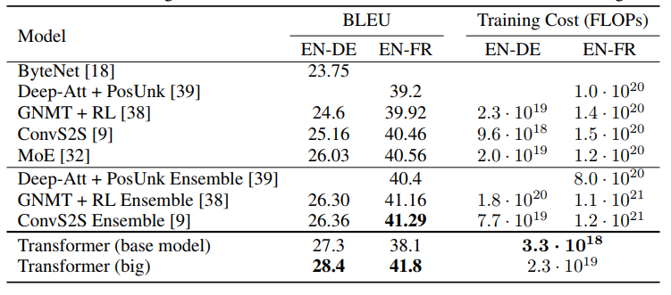
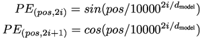
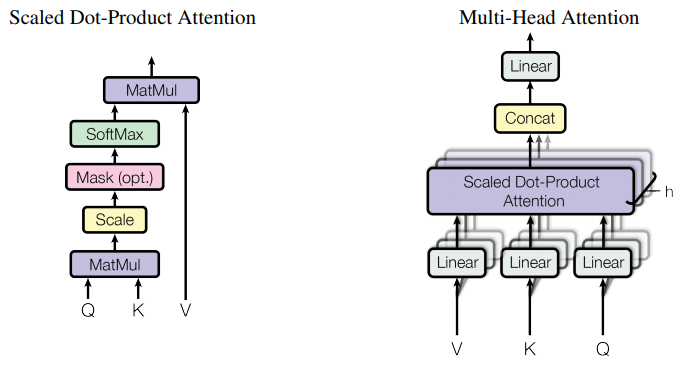

## Attention Is All You Need
[paper](https://arxiv.org/pdf/2005.12872.pdf)  
[code](https://github.com/facebookresearch/detr)  
[insight](https://blog.csdn.net/longxinchen_ml/article/details/86533005)

---
### STRUCTURE

---
### Experimental Results  
* English-to-German and English-to-French newstest2014 tests  

---
### Algorithm  
* position embedding  
注意力机制没有类似RNN的网络结构所以缺少一种理解输入单词顺序的方法，论文提出位置编码的方法，
和word embedding向量求和一起表示编码向量。  
其编码方式为（pos的词位置索引，i的向量维度）：  
  
* “multi-headed” attention  
  
扩展多个Attention子空间，扩展网络的广度，通过concat融合多头信息。

---
### Intuition  
seq2seq模型是以往都是较为复杂的RNN模型，论文通过注意力机制的巧妙使用搭建了简单的seq2seq模型，
并且在性能上达到了最佳水平。