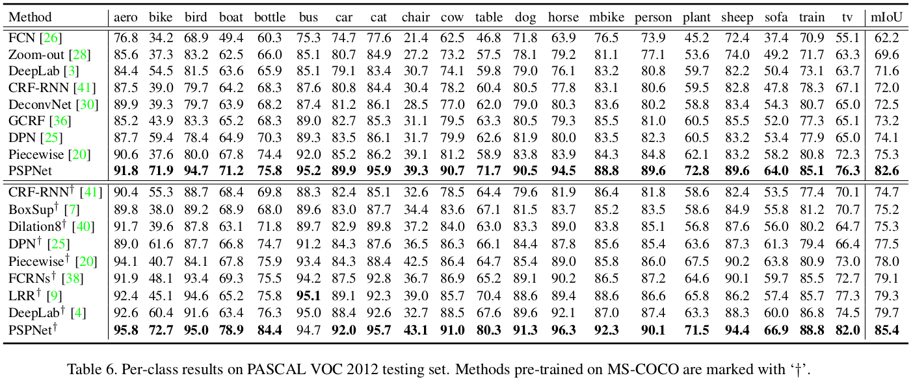

## PSP
[paper](https://arxiv.org/pdf/1612.01105.pdf)  
[code](https://github.com/hszhao/PSPNet)  

---
### STRUCTURE
  

---
### Experimental Results
* ImageNet Scene Parsing Challenge 2016  

* PASCAL VOC 2012  

* Cityscapes  

---
### Algorithm  
* 金字塔池化模块  
平均池化层会被更好的特征占据融合子区域的信息，为了进一步避免丢失表征不同子区域的语境信息，
论文提出了一个包含不同尺度、不同子区域间关系的分层全局信息。将该金字塔池化模块的输出作为神经网络的最终特征图。
网络输出使用双线性插值直接对低维特征图上采样，使其与原始特征图尺度相同。
最后，将不同层级的特征图拼接为最终的金字塔池化全局特征。  
金字塔池化模块能收集不同尺度的语境信息并融合，会比全局池化所得的全局信息更具代表性。  
* 辅助损失函数  
将深层网络的优化问题可分解为两个，单个问题的求解就会比较简单。  
在主干网络上新增一个辅助损失函数，其只作用在浅层网路上，辅助损失函数有助于优化学习过程，可以通过对两个损失函数
加权来平衡网络损失效果。

---
### Intuition  
Pyramid Scene Parsing Network　金字塔场景分析网络  
分析分割网络存在的问题：  
1.Mismatched Relationship  
由于形态相似的目标会造成错误分类，但是加入目标周围的场景信息就可以做出更加准备的预测。  
2.Confusion Categories　　
许多标签之间存在联系，可以通过标签之间的关系进行弥补，减少一个目标中预测出多个类别。  
3.Inconspicuous Classes  
对于一些小目标，会和大目标识别到一起，模型会忽略掉这些小目标。  
所以PSPNet通过聚合不同语境的信息使得网络拥有理解全局信息的能力。