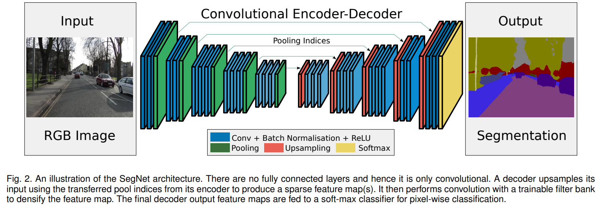
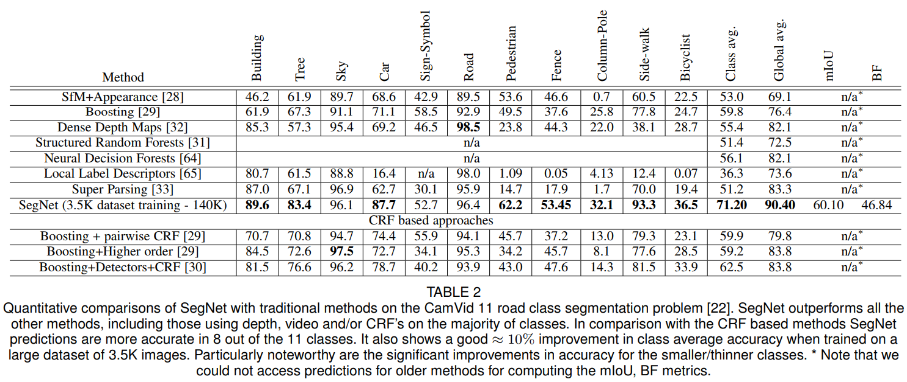
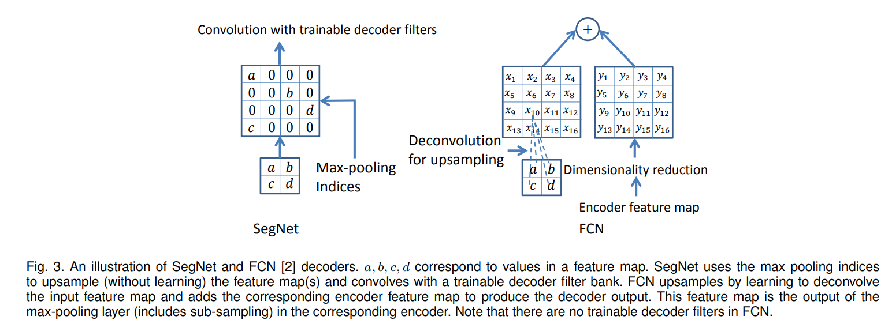

## SegNet
[paper](https://arxiv.org/pdf/1511.00561v3.pdf)  
[code](http://mi.eng.cam.ac.uk/projects/segnet/)  

---
### STRUCTURE
  

---
### Experimental Results
* CamVid 11 road

---
### Algorithm  
* 网络架构  
网络分为编码和解码两个阶段，其中编码阶段将预训练的vgg网络移除全连接层后作为编码网络，
使得网络性能更强且易于训练。  
* 解码复用max-pooling indices  
最大池化可以实现在输入图像上进行小的空间位移时保持平移不变性。
连续的下采样导致了在输出的特征图上，每一个像素都重叠着着大量的输入图像中的空间信息。
对于图像分类任务，多层最大池化和下采样由于平移不变性可以获得较好的鲁棒性，但导致了特征图大小和空间信息的损失。
图像分割任务中边界划分至关重要，而这么多有损边界细节的图像表示方法显然不利于分割。
因此，在进行下采样之前，在编码器特征映射中获取和存储边界信息是十分重要的。
如果推理过程中的内存不受约束，则所有编码器特征映射(在下采样后)都可以存储。
在实际应用中，情况通常不是这样，于是提出了一种更有效的方法来存储这些信息。
它只存储最大池化索引，即存储每个池化窗口中最大特征值的位置，用于每个编码器特征映射。  
SegNet和UNet的结构类似，但是UNet没有利用池化位置的索引，
而是将编码阶段的整个特征图传输到相应的解码器（以牺牲更多内存为代价），并将其连接，
再进行上采样（通过反卷积），从而得到解码器特征图。  
  
SegNet使用编码阶段的max pool位置直接对解码阶段的输入特征图上采样还原。  
实际上在GPU内存充足的情况下，使用UNet的整个特征图输入到相应的解码器效果更好。

---
### Intuition  
对UNet的进一步升级，使用预训练的backbone做为编码器，使用记录池化位置来减少显存开销。