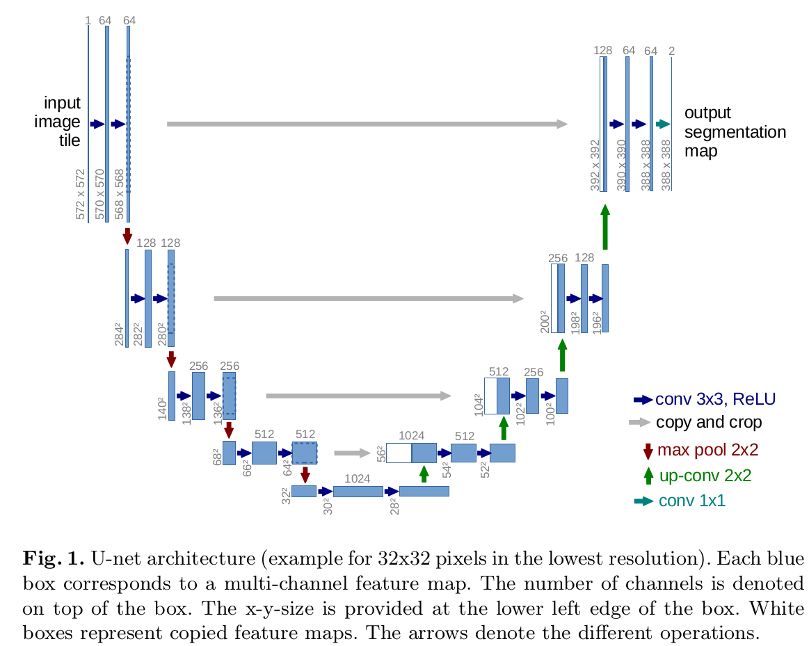
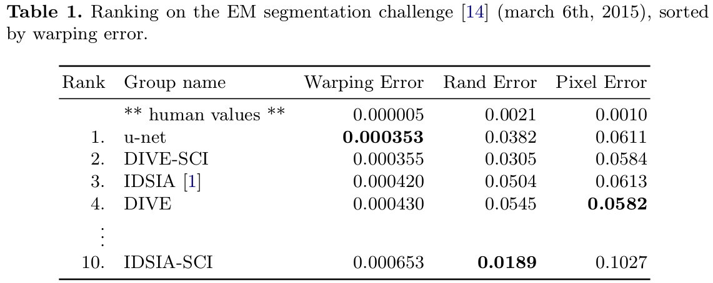
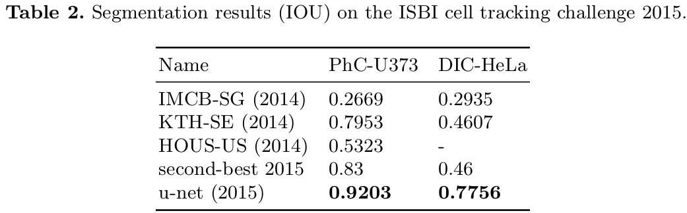
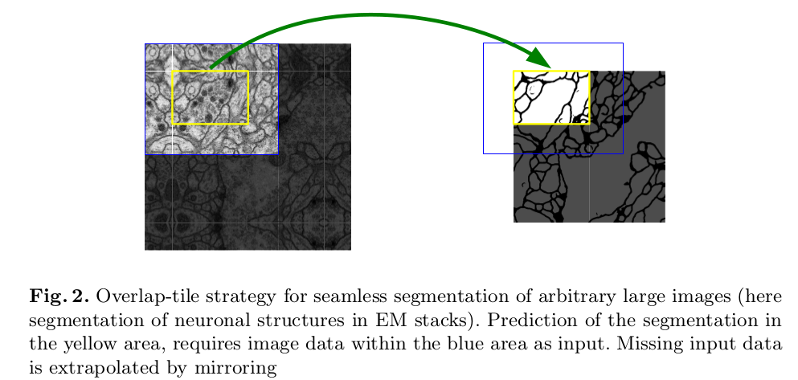
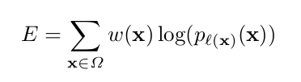
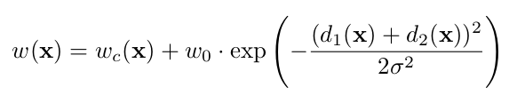

## UNET
[paper](http://www.arxiv.org/pdf/1505.04597.pdf)  
[code](http://lmb.informatik.uni-freiburg.de/people/ronneber/u-net)  

---
### STRUCTURE
  

---
### Experimental Results
* EM segmentation challenge

* ISBI cell tracking challenge 2015

---
### Algorithm  
* Overlap-tile strategy
对于较大的图片，可以无缝分割任意大图成小块预测后再做拼接。
对于分割边缘的上下文信息通过镜像原图来弥补丢失的上下文信息。  
  
* 加权边缘背景像素的损失值  
为了更好的分离相接触的同一类别，使接触单元之间的分离背景标签在损失函数中获得大的权重。
以此来提升对于互相接触的相同物体之间缝隙的分割效果。  
* 损失函数  
在每个像素上做加权交叉熵  
  
其中权重计算方式为  
  
其中wc(x)为均衡类别的权重，d1 d2为和相邻同类别目标的距离

---
### Intuition
搭建全卷积网络，在少量数据的情况下产生更加精准的分割。