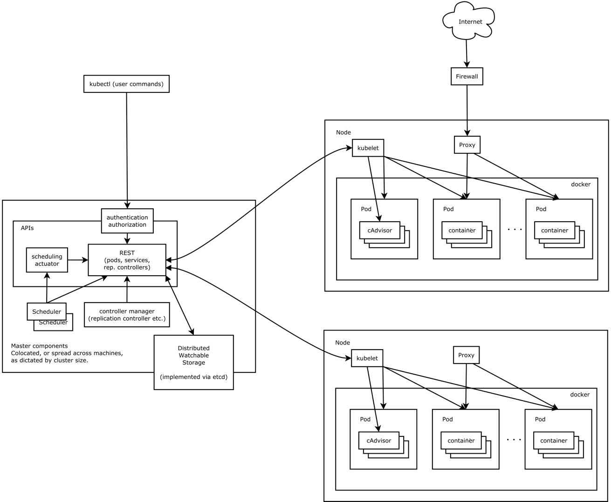

## K8s
[Link](https://kubernetes.io/docs/home/)  
[Insight](https://zhuanlan.zhihu.com/p/53260098)  
[中文社区](http://docs.kubernetes.org.cn/)  

---
### OVERVIEW  
Kubernetes，又称为 k8s（首字母为 k、首字母与尾字母之间有 8 个字符、尾字母为 s，所以简称 k8s）
或者简称为 “kube” ，是一种可自动实施 Linux 容器操作的开源平台。
它可以帮助用户省去应用容器化过程的许多手动部署和扩展操作。
也就是说，可以将运行 Linux 容器的多组主机聚集在一起，由 Kubernetes 管理这些集群。
而且，这些集群可跨公共云、私有云或混合云部署主机。
因此，对于要求快速扩展的云原生应用而言（例如借助 Apache Kafka 进行的实时数据流处理），
Kubernetes 是理想的托管平台。

---
### STRUCTURE  

