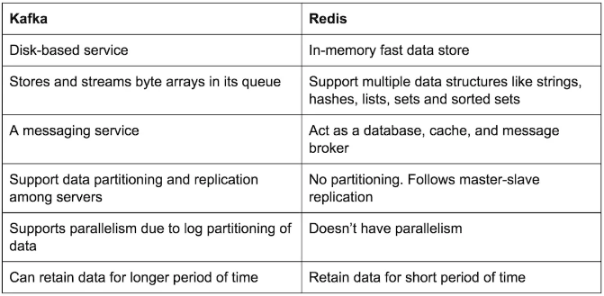
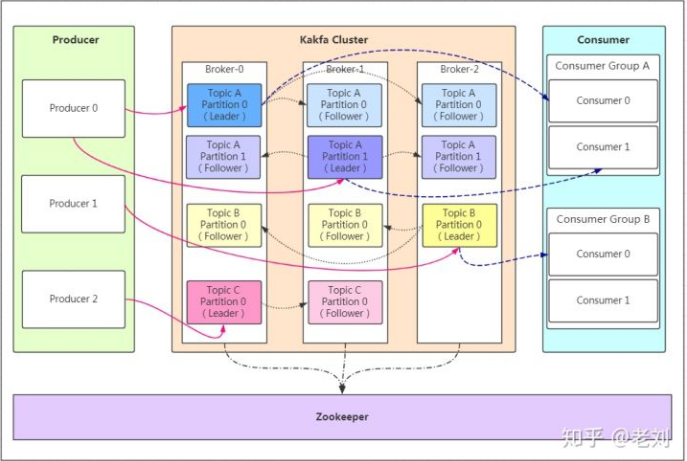

## kafka
[Link](http://kafka.apache.org/)  
[Insight](https://zhuanlan.zhihu.com/p/68052232)  
[中文社区](http://kafka.apachecn.org/)

---
### OVERVIEW  
Apache Kafka是一个分布式的流处理平台。  
流处理平台有以下三种特性:  
1. 可以让你发布和订阅流式的记录。这一方面与消息队列或者企业消息系统类似。
2. 可以储存流式的记录，并且有较好的容错性。
3. 可以在流式记录产生时就进行处理。  

Kafka主要应用于两大类别的场景：
1. 构造实时流数据管道，它可以在系统或应用之间可靠地获取数据。 (相当于message queue)
2. 构建实时流式应用程序，对这些流数据进行转换或者影响。 (就是流处理，通过kafka stream topic和topic之间内部进行变化)

相对于[Redis](../Redis/README.md)的区别：  

---
### STRUCTURE  

