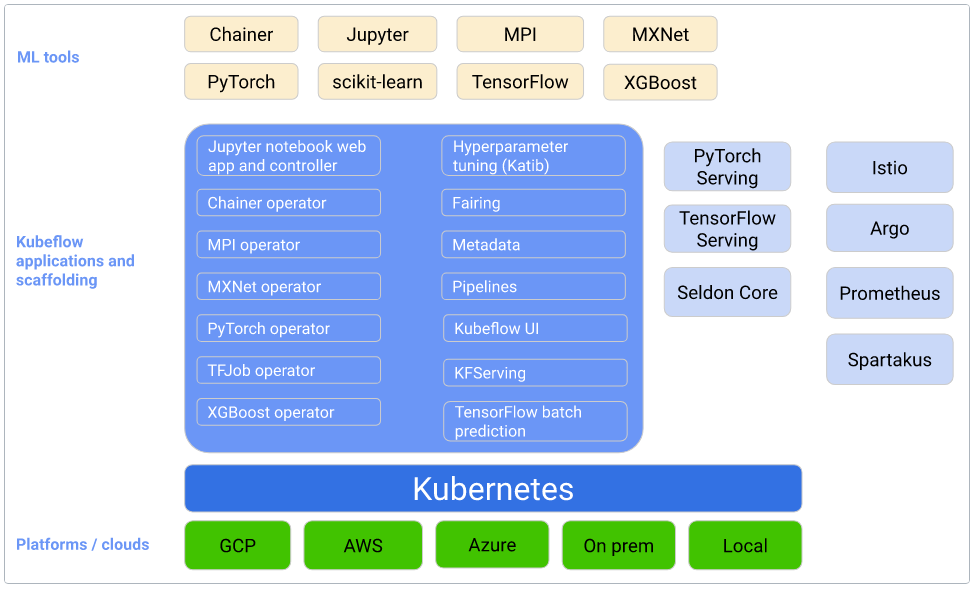

## Kubeflow
[Link](https://www.kubeflow.org/)  

---
### OVERVIEW  
Kubeflow项目致力于使机器学习（ML）工作流在Kubernetes上的部署简单，可移植且可扩展。
提供一种直接的方法来将ML的同类最佳的开源系统部署到各种基础结构中。在运行Kubernetes的任何地方，都能够运行Kubeflow。

---
### STRUCTURE  

