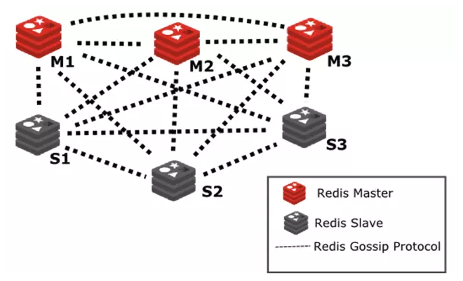

## Redis
[Link](https://redis.io/)  
[Insight](https://zhuanlan.zhihu.com/p/83290055)  
[中文社区](http://www.redis.cn/)

---
### OVERVIEW  
Redis（全称：Remote Dictionary Server 远程字典服务）
是一个开源的使用ANSI C语言编写、支持网络、可基于内存亦可持久化的日志型、Key-Value数据库，
并提供多种语言的API。它支持多种数据结构，如字符串（strings），散列（hashes），列表（lists），
集合（sets），有序集合（sorted sets）。
Redis内置了复制（replication），LUA脚本（Lua scripting），LRU驱动事件（LRU eviction），
事务和不同级别的磁盘持久化， 并通过 Redis哨兵和自动分区提供高可用性。  
Redis是一个内存中的数据结构存储系统。

---
### STRUCTURE  

