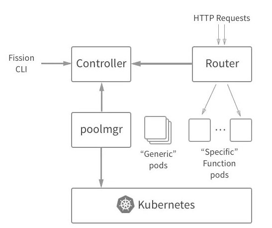

## fission
[Link](https://fission.io/)  

---
### OVERVIEW  
Fission 是一个构建在 Kubernetes 之上的 FaaS/Serverless 函数框架。  
Faas (Function as a server)  
Fission维护了两个空间，一个是环境镜像空间，一个是函数服务空间，函数服务依赖环境镜像启动服务  
* 创建环境镜像
```
# 创建一个名为python的镜像环境
fission env create --name python --image fission/python-env:latest
```
* 创建函数服务
```
# 使用python环境镜像创建一个名为hello的函数服务
fission function create --name hello --env python --code hello.py
```
* 映射路由
```
# 映射到 /hello路径
fission route create --method GET --url /hello --function hello
```
* 函数服务测试
```
# 指定函数服务名字
fission function test --name hello
```

---
### STRUCTURE
冷启动问题: Serverless 函数其中一个目标就是函数只在运行时使用 CPU/内存资源。这样优化了函数的资源消耗，
但也带来了从空闲到启动的性能损耗（冷启动损耗）。  
为了优化冷启动延迟，Fission 为每个环境保持着一个运行容器池。当一个函数请求进来之后， 
Fission 不需要部署一个新容器——它只需要选择一个已经在运行的容器，将函数拷贝到容器当中，将函数动态加载起来，并将请求路由到这个实例即可。  
  
Controller 负责追踪函数、HTTP 路由、事件触发器和环境镜像。  
poolmgr 负责管理空闲的环境容器池、将函数加载到这些容器当中、以及杀死空闲的函数实例。  
Router 接收 HTTP 请求，并将他们路由到函数实例上，如果需要会向 poolmgr 请求新的实例。