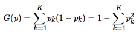
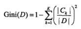

## Decision Tree
### OVERVIEW  
决策树可以看成是if-then规则的集合。由决策束的根节点到叶节点的每一条路径构成一条规则，叶节点的作为规则的结论。  
  
决策数据学习通常包含三个步骤：特征选择、决策树的生成、决策树剪枝。
### 算法步骤
#### 特征选择
* 信息增益  
条件熵H(Y|X)表示在已知随机变量X的条件下随机变量Y的不确定性。  
  
其中  
信息增益表示得知特征X的信息而使得Y的信息的不确定性减少的程度。
特征A对训练数据集D的信息增益g(D,A)，定义为集合D的经验熵H(D)与特征A给定条件下D的经验条件熵H(D|A)之差：  
  
数据集D中有k个类别，|Ck|表示第k类数量，特征A有n个可能的取值，Di为数据集中特征A取ai的数据子集，
Dik为第k类且特征取ai的数据子集，其信息增益的相关计算为：  
数据集D的熵H(D)：  
  
条件熵H(D|A)：  
  
再计算其信息增益 g(D,A)=H(D)-H(D|A)
* 信息增益比  
特征A对训练数据集D的信息增益比定义为其信息增益与训练数据集经验熵之比:  
  
* 基尼指数  
基尼指数，基尼系数代表了模型的不纯度，基尼系数越小，不纯度越低，特征越好。  
假设有K个类，样本点属于第k类的概率为pk，则概率分布的基尼指数定义为：  
  
对于样本集D,Ck为D中属于k类的样本子集，其基尼指数为：  
  
对于被特征A某一可能值a分割成D1和D2两部分的集合D，其基尼指数为：  
(Gini(D,A)表示经A=a分割后集合D的不确定性)  
  

#### 决策树的生成
* ID3  
输入：训练数据集D，特征集A，阈值ε  
输出：决策树T  
(1)若D中所有实例属于同一类Ck，则T为单结点树，并将Ck作为该结点的类标记，返回T  
(2)若A为空集，则T为单结点树，并将D中实例数最大的类Ck作为该结点的类标记，返回T  
(3)按照信息增益计算A中各特征对D的信息增益，选择信息增益最大的特征Ag  
(4)如果Ag的信息增益小于阈值ε，则置T为单结点树，并将D中实例数最大的类Ck作为该结点的类标记，返回T  
(5)对Ag中的每一可能值ai，依Ag=ai将D分割为若干非空子集Di，将Di中实例数最大的类作为标记，构建子结点，由结点及其子结点构成树T，返回T  
(6)对第i个子结点，以Di为训练集，以A-{Ag}为特征集，递归地调用(1)~(5)步，得到子树Ti，返回Ti  
* C4.5  
输入：训练数据集D，特征集A，阈值ε  
输出：决策树T  
(1)若D中所有实例属于同一类Ck，则T为单结点树，并将Ck作为该结点的类标记，返回T  
(2)若A为空集，则T为单结点树，并将D中实例数最大的类Ck作为该结点的类标记，返回T  
(3)按照信息增益比计算A中各特征对D的信息增益比，选择信息增益比最大的特征Ag  
(4)如果Ag的信息增益比小于阈值ε，则置T为单结点树，并将D中实例数最大的类Ck作为该结点的类标记，返回T  
(5)对Ag中的每一可能值ai，依Ag=ai将D分割为若干非空子集Di，将Di中实例数最大的类作为标记，构建子结点，由结点及其子结点构成树T，返回T  
(6)对第i个子结点，以Di为训练集，以A-{Ag}为特征集，递归地调用(1)~(5)步，得到子树Ti，返回Ti
* CART  
    * 回归树（平方误差最小化准则）  
    输入：训练数据集D  
    输出：回归树f(x)  
    假设已将输入空间划分为M个单元R1,R2,R3......Rm，并在每一个单元Rm上有固定的输出值Cm，
    Cm最优值就是本单元上所有输入值对应的y的平均值，其公式为：  
    特征空间的划分采用启发式的方法，选择第j个变量x(j)和它对应的取值s,作为切分变量和切分点，定义两个区域：  
    然后寻找最优切分变量j和切分点s。  
    其算法步骤为：  
    (1)选择最优切分变量j与切分点s,求解  
    遍历变量j，对固定的切分变量j扫描切分点s  
    (2)用选定的(j,s)划分区域并决定相应的输出值  
    (3)继续对两个子区域调用步骤(1)(2)，直至满足停止条件  
    (4)将输入空间划分为M个区域，生成决策树  
    * 分类树（基尼指数最小化原则）  
    输入: 训练数据集D  
    输出：分类树  
    (1)训练数据集为D,计算现有特征对训练数据集的基尼指数，此时对于每一个特征A,对其可能取得每一个值a，
    根据此值将训练样本切分为D1和D2两部分，然后计算A=a的基尼指数  
    (2)在所有可能的特征以及所有可能的值里面选择基尼指数最小的特征及其切分点作为最优的特征及切分点，
    从结点生成两个子结点，将训练数据集分配到子结点中去  
    (3)递归调用步骤(1)(2)，直至满足停止条件  
    (4)生成分类决策树  

#### 决策树减枝  
* ID3和C4.5的减枝  
设树T的叶结点个数为|T|，t是树T的叶结点，该叶结点有Nt个样本点，其中k类的样本点有Ntk个，Ht(T)为叶结点上的经验熵，则损失函数为：  
  
其具体计算步骤为:  
(1)计算每个结点的经验熵  
(2)递归地从树的叶结点向上回缩，设一组叶结点回缩到其父结点之前与之后的整体树为TB与TA，如果Cα(TA)⩽Cα(TB)则剪枝，将父结点变成新的叶结点  
(3)返回（2），直至不能继续，得到损失函数最小的子树Tα
* CART的减枝  
暂缓
### 代码示例
[code](https://nbviewer.jupyter.org/github/wan-h/Brainpower/blob/master/Code/ML/DecisionTree.ipynb)