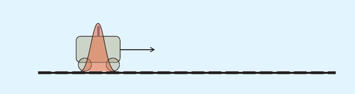
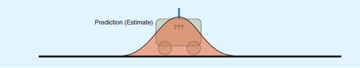
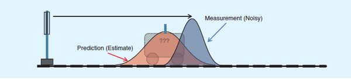
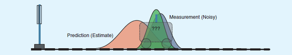

## Kalman Filter
[Insight 1](https://zhuanlan.zhihu.com/p/36745755)  
[Insight 2](https://blog.csdn.net/varyshare/article/details/95065650)
### OVERVIEW  
卡尔曼滤波（Kalman filtering）是一种利用线性系统状态方程，通过系统输入输出观测数据，对系统状态进行最优估计的算法。
由于观测数据中包括系统中的噪声和干扰的影响，所以最优估计也可看作是滤波过程。  
### Example
t=k-1时小车的位置服从红色的正态分布。假设位置在21cm，位置误差为0.3cm，即μ=21，σ=0.3,速度为2cm/s  
  
根据小车的这个位置，我们可以根据位置与速度经验公式，预测出t=k时刻它的位置：位置均值是21+2=23cm，
我对自己速度预测不确定度为0.4cm，那么此时小车位置预测误差为0.5cm
（0.5是这样得到的：如果k-1时刻估算出的最优位置的偏差是0.3，你对自己预测的不确定度是0.4，他们平方相加再开方，
就是0.5，为什么是这样？用了正态分布的线性叠加定理，即位置和速度两正态分布的和也满足正态分布，方差是二者平方 ）。
可以看出0.5>0.3，此时分布变“胖”了，这很好理解——因为在递推的过程中又加了一层噪声（即预测不稳定度），
所以不确定度变大了  
  
为了避免纯估计带来的偏差，我们在t=k时刻对小车的位置坐标进行一次雷达测量，当然雷达对小车距离的测量也会受到种种因素的影响，
会带来测量误差，这个测量误差的均方差是0.4cm，假设此时测量值是25cm(即均值为25)。而且测量结果也复合正态分布，
于是可以画出小车在t=1时的位置服从蓝色分布  
  
两个事件的发生都是概率性的，不能完全相信其中的任何一个！如果我们具有两个事件，从直觉或者是理性思维上讲，
是不是认定两个事件都发生，就找到了那个最理想的估计值？好了，抽象一下，得到：两个事件同时发生的可能性越大，
我们越相信它！要想考察它们同时发生的可能性，就是将两个事件单独发生的概率相乘。
于是乎，卡尔曼滤波的思想诞生了！Kalman找到了相应权值，使红蓝分布合并为下图这个绿色的正态分布  
  
绿色分布不仅保证了在红蓝给定的条件下，小车位于该点的概率最大，而且，它居然还是一个正态分布！
正态分布就意味着，可以把它当做初值继续往下算了！这是Kalman滤波能够迭代的关键