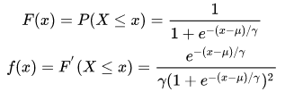
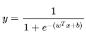
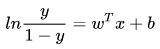
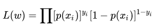
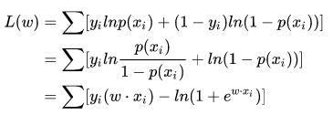
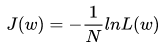
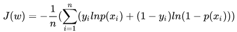
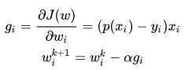

## Logistic Regression
### OVERVIEW  
* Logistic分布  
Logistic 分布是一种连续型的概率分布，其分布函数和密度函数分别为：  
  
其中，μ表示位置参数，γ为形状参数,在深度学习中常用到的Sigmoid函数就是Logistic的分布函数在μ=0,γ=1 的特殊形式  
* Logistic回归  
区别于感知机，逻辑回归找到分类概率 P(Y=1) 与输入向量 x 的直接关系，其实质为用回归的方法做分类  
理想的条件概率函数p(Y=1|x)为单位阶跃函数，但是其不可微，于是使用替代函数：  
  
且其几率取ln为：  
  
* 代价函数  
求解模型中的参数使用极大似然估计法，其似然函数为：  
  
方便求解，两边取对数：  
  
定义损失函数为整个数据集上的平均对数似然损失：  
  
所以在逻辑回归中，最大化似然函数和最小化损失函数是等价的  
* 求解  
逻辑回归可使用随机梯度下降进行求解，其损失函数为：  
  
通过求导数找下降方向来更新参数：  
  
当更新参数损失函数下降小于一个阈值时则停止更新迭代
### 代码示例
[code](https://nbviewer.jupyter.org/github/wan-h/Brainpower/blob/master/Code/ML/LogisticRegression.ipynb)