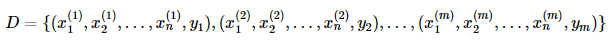
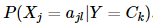
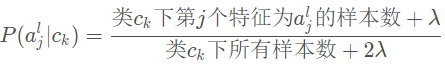
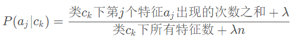
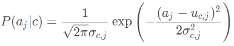
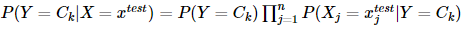

## Naive Bayes
### OVERVIEW  
朴素贝叶斯是基于[贝叶斯定理](../../Math/Basic/Bayes/README.md)与特征条件独立假设的分类方法。
### 算法步骤
针对样本集：  
  
其中 yi,i=1,2,..,m 表示样本类别，取值为 {C1,C2,...,CK}。  
* 计算先验概率  
求出样本类别的个数 K 。对于每一个样本 Y=Ck ，计算出 P(Y=Ck) 。其为类别 Ck 在总样本集中的频率。  
* 计算条件概率  
将样本集划分成 K 个子样本集，分别对属于 Ck 的子样本集进行计算，计算子集中取不同特征值时的条件概率。    
  
其具体计算方法分为几种：  
下式引入平滑因子λ防止未出现的特征概率为0，可取1
1.伯努利模型  
  
2.多项式模型  
  
3.高斯模型  

* 计算预测样本后验概率  
针对预测样本，计算其对于每个类别 Ck 的后验概率：  
  
概率值最大的类别即为待预测样本的预测类别。
### 代码示例
[code](https://nbviewer.jupyter.org/github/wan-h/Brainpower/blob/master/Code/ML/NaiveBayes.ipynb)