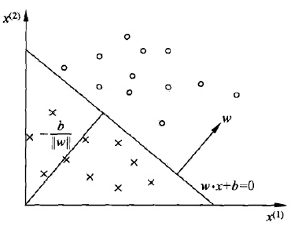
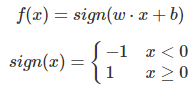
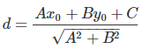
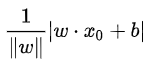
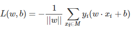
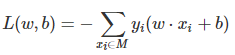
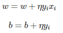

## Perceptron
### OVERVIEW  
感知机（Perceptron）是二类分类的线性分类模型。  
  
感知机从输入空间到输出空间的模型如下：  
  
感知机学习的目标是求得一个能够将训练数据集正实例点和负实例点完全正确分开的分离超平面。
### 原理 
直线Ax+By+C=0,点P的坐标为(x0, y0)到直线的距离公式为：  
  
假设超平面时h=wx+b,其中w=(w0, w1, w2, ...wm),x=(x0, x1, x2, ...xm),
样本点x0到超平面的距离为：  
  
我们损失函数的优化目标，就是期望使误分类的所有样本，到超平面的距离之和最小。  
对于误分类的样本wx+b>0时y=-1，wx+b<0时y=1，所以定义损失函数如下：  
  
由于存在常数项，则简化损失函数为：  
  
确定损失函数后，通过随机梯度下降法最小化损失函数即可  
### 算法步骤
输入：训练数据集T=(x1,y1),(x2,y2),...,(xN,yN)，yi∈{−1,+1}，学习率η(0<η<1)
输出：w,b；感知机模型f(x)=sign(w⋅x+b)
* 赋初值w0, b0  
* 随机选取数据点(xi, yi)  
* 判断该数据点是否为当前模型的误分类点，即判断若yi(w⋅xi+b)<=0则更新  

* 转到第二步，直到训练集中没有误分类点
### 代码示例
[code](https://nbviewer.jupyter.org/github/wan-h/Brainpower/blob/master/Code/ML/Perceptron.ipynb)