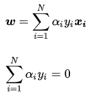
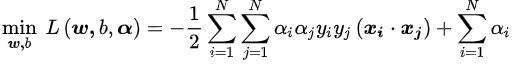
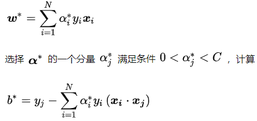

## SVM
### OVERVIEW  
支持向量机（support vector machines, SVM）是一种二分类模型，它的基本模型是定义在特征空间上的间隔最大的线性分类器，
SVM还包括核技巧，这使它成为实质上的非线性分类器。
### 原理 

* 定义问题  
对于给定的数据集T和超平面wx+b=0，定义超平面关于样本点(xi, yi)的几何间隔为  
  
超平面关于所有样本点的几何间隔的最小值为  
  
实际上这个距离就是支持向量到超平面的距离,这个距离的点就为支持向量，SVM模型的求解最大分割超平面问题可以表示为以下约束最优化问题  
  
将约束条件两边同时除以γ得到  
  
因为||w||, γ都是标量，所以为了表达式简洁起见，可以将有系数的w,b视为新的额wb,即得到  
  
所以上面的几何间隔分子最小值就取为1，因此最大化γ，等价于最大化，也就等价于  
所以SVM的最优化问题定义为:  
  

* 求解问题  
一个含有不等式约束的凸二次规划问题，可以对其使用[拉格朗日乘子法](../../Math/Basic/LagrangeMultiplierMethod/README.md)得到其对偶问题。  
将有约束的原始目标函数转换为无约束的新构造的拉格朗日目标函数：  
  
其对偶问题是一个极大极小值问题（可理解为极小值问题找到最近的点，极大值问题找到间隔最大的线）:  
  
先求极小值部分,对w和b的偏导为0，可得:  
  
将以上两个等式带入拉格朗日目标函数，消去w和b，得:  
  
在求极大值部分，此时问题转化为：  
  
把目标式子加一个负号，将求解极大转换为求解极小  
  
这里可以使用SMO算法求出最优解α，可以展开后求导解α,再带入下式解除w,b:  
  

* 软间隔最大化  
为了适用线性不可分的数据，引入松弛变量ξ，将原优化问题改写成：  
  
C为惩罚系数，越小则对误分类的乘法越小，其后续解法和上面一致  

* 核函数  
对于输入空间中的非线性分类问题，可以通过非线性变换将它转化为某个维特征空间中的线性分类问题，
在高维特征空间中学习线性支持向量机。  
在线性支持向量机学习的对偶问题里，目标函数和分类决策函数都只涉及实例和实例之间的内积，所以不需要显式地指定非线性变换，
而是用核函数替换当中的内积。  
  
核函数可以为高斯核函数、多项式核函数等等，举例高斯核函数为:    

### 算法步骤
输入：训练数据集T={(x1, y1), (x2, y2), ..., (xn, yn)}其中，yi∈{+1, -1}  
输出：分离超平面和分类决策函数  
* 选择惩罚参数C>0，构造并求解凸二次规划问题  
  
* 计算  
  
* 求分离超平面  
  
### 代码示例
[code](https://nbviewer.jupyter.org/github/wan-h/Brainpower/blob/master/Code/ML/SVM.ipynb)