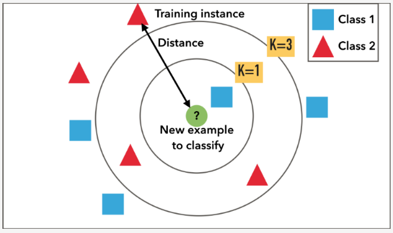

## k_nearest neighbor
### OVERVIEW  
k近邻法的思路为在特征空间中，如果一个样本附近的k个最近(即特征空间中最邻近)样本的大多数属于某一个类别，则该样本也属于这个类别。  
其三个基本要素为：k值的选择、距离度量、分类决策规则。  
  
k-NN也是一种回归方法，其回归值为k最近邻点的平均值
### 代码示例
[code](https://nbviewer.jupyter.org/github/wan-h/Brainpower/blob/master/Code/ML/k-NN.ipynb)