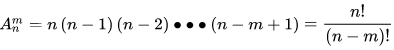

## 排列组合
### 排列
从n个不同元素中，任取m(m≤n,m与n均为自然数,下同）个不同的元素按照一定的顺序排成一列，叫做从n个不同元素中取出m个元素的一个排列  
从n个不同元素中取出m(m≤n）个元素的所有排列的个数，叫做从n个不同元素中取出m个元素的排列数，用符号 A(n,m）表示  

### 组合
从n个不同元素中，任取m(m≤n）个元素并成一组，叫做从n个不同元素中取出m个元素的一个组合  
从n个不同元素中取出m(m≤n）个元素的所有组合的个数，叫做从n个不同元素中取出m个元素的组合数,用符号 C(n,m) 表示  
  
可以理解为组合不考虑顺序关系，排列除掉m个元素的内在顺序关系即可得到组合