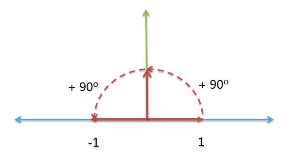
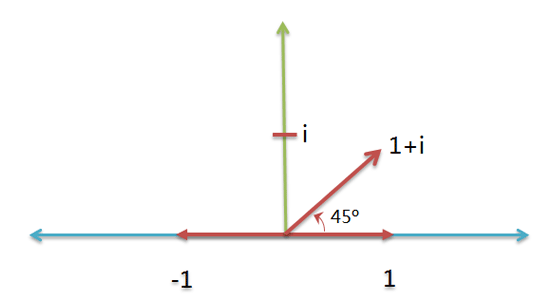
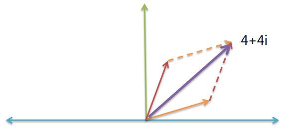
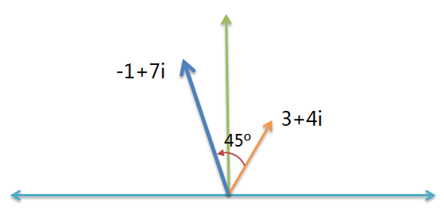
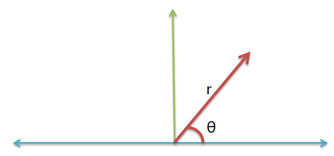

## 复数
### 虚数
  
假设有一根数轴，上面有两个反向的点：+1和-1  
这根数轴的正向部分，可以绕原点旋转，逆时针旋转180度，+1就会变成-1,这相当于两次逆时针旋转90度  
```
(+1) * (逆时针旋转90度) * (逆时针旋转90度) = (-1)  
```
如果把+1消去，这个式子就变为：
```
(逆时针旋转90度)^2 = (-1) 
``` 
将"逆时针旋转90度"记为 i ：　
```
i^2 = (-1)  
```
虚数 i 就是逆时针旋转90度，i 不是一个数，而是一个旋转量  
实数分布在一个一维的线上，而虚数则是一个上升到二维的表示  
### 复数
  
数学上用一种特殊的表示方法，表示这个二维坐标：用 + 号把横坐标和纵坐标连接起来，
比如，把 ( 1 , i ) 表示成 1 + i ，
这种表示方法就叫做复数（complex number），其中 1 称为实数部，i 称为虚数部。
只要确定横坐标和纵坐标，比如( 1 , i )，就可以确定某个实数的旋转量（45度）。
### 虚数的作用
* 加法  
  
物理学需要计算"力的合成"，假定一个力是 3 + i ，另一个力是 1 + 3i，
根据"平行四边形法则"，合成力就是  
  ```
  ( 3 + i ) + ( 1 + 3i ) = ( 4 + 4i )  
  ```
* 乘法  
  
一条船的航向是 3 + 4i，逆时针增加45度，45度的航向就是 1 + i，计算新航向，只要把这两个航向 3 + 4i 与 1 + i 相乘就可以了：
  ```
  ( 3 + 4i ) * ( 1 + i ) = ( -1 + 7i )
  ```  
  如果航向逆时针增加90度，就更简单了，因为90度的航向就是 i ，所以新航向等于： 
  ```
  ( 3 + 4i ) * i = ( -4 + 3i )
  ```   
  **乘法的数学证明** ：  
    
  任何复数 a + bi，都可以改写成旋转半径 r 与横轴夹角 θ 的形式  
  假定现有两个复数 a + bi 和 c + di，可以将它们改写如下：  
  ```
  a + bi = r1 * ( cosα + isinα )    
  c + di = r2 * ( cosβ + isinβ )  
  ```
  这两个复数相乘，( a + bi )( c + di ) 就相当于
  ```
  r1 * r2 * ( cosα + isinα ) * ( cosβ + isinβ )
  ```
  展开后得到
  ```
  cosα * cosβ - sinα * sinβ + i( cosα * sinβ + sinα * cosβ )
  ```
  根据三角函数公式，上面的式子就等于
  ```
  cos(α+β) + isin(α+β)
  ```
  所以
  ```
  ( a + bi )( c + di )　＝　r1 * r2 * ( cos(α+β) + isin(α+β) )
  ```
  这就证明了，两个复数相乘，就等于旋转半径相乘、旋转角度相加。