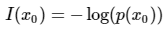
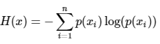
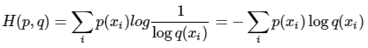
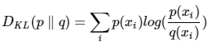
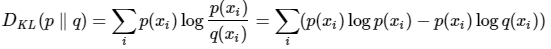
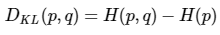
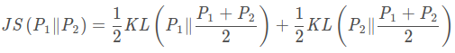
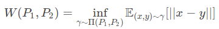

## 熵
### 信息量
信息量来衡量一个事件的不确定性，一个事件发生的概率越大，不确定性越小，则其携带的信息量就越小  
  
### 熵
熵用来衡量一个系统的混乱程度，代表系统中信息量的总和；熵值越大，表明这个系统的不确定性就越大  
  
### 交叉熵
交叉熵使用分布q(x)表示目标分布p(x)的困难程度  
  
### 相对熵（KL散度）
相对熵表示同一个随机变量的两个不同分布间的距离  
  
熵、交叉熵、相对熵的转换公式为：  
  
  
### JS散度  
相对熵存在非对称个的缺陷,即KL(P||Q)≠KL(Q||P)  
于是提出JS散度满足对称性:  
  
其取值范围在0到1之间，PQ分布差距越大，JS散度值越大  
### Wasserstein距离  
当两个分布没有任何重叠时，KL散度没有意义，JS散度为一个常数，梯度为0，也就导致梯度消失  
于是提出了Wasserstein距离:  
  
Π(P1,P2) 是 P1和 P2分布组合起来的所有可能的联合分布的集合。
对于每一个可能的联合分布 γ，可以从中采样 (x,y)∼γ得到一个样本 x和y，并计算出这对样本的距离 ||x−y||，
所以可以计算该联合分布 γ下，样本对距离的期望值。在所有可能的联合分布中能够对这个期望值取到的下界就是Wasserstein距离。  
Wasserstein距离可以为没有重叠的两个分布最小化其距离提供梯度。