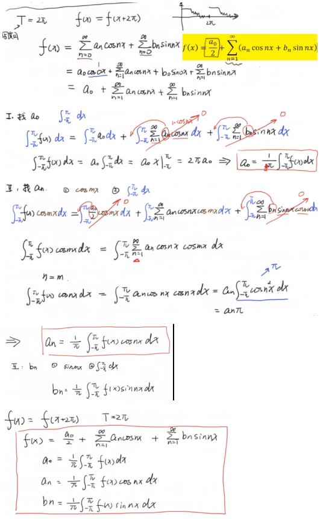
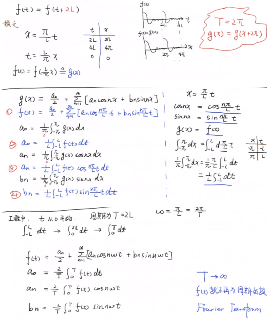
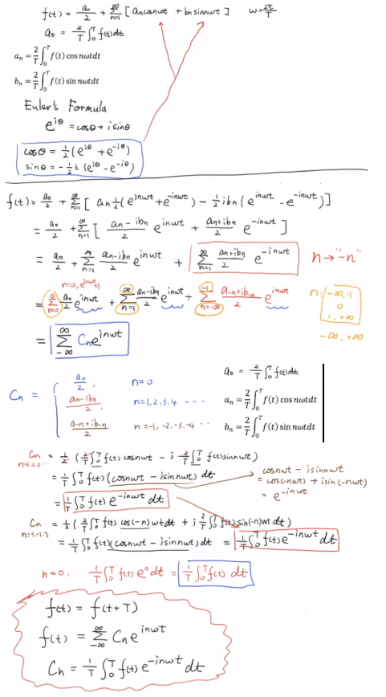

## 傅里叶
### 傅里叶级数
* 周期为2Π的函数展开成傅里叶级数  
其证明涉及到[三角函数的正交性](../Trigonometric/README.md)  
  

* 周期为2L的函数展开成傅里叶级数  
  

* 傅里叶级数的复数形式  
其证明设计到[欧拉公式](../Euler/README.md)  
  
### 傅里叶变换
傅里叶变换为傅里叶级数的周期T趋近于无穷的推导  
当Δω趋近于无穷小时，频谱图就从离散变为了连续，横坐标的nω0就变成了连续的ω
