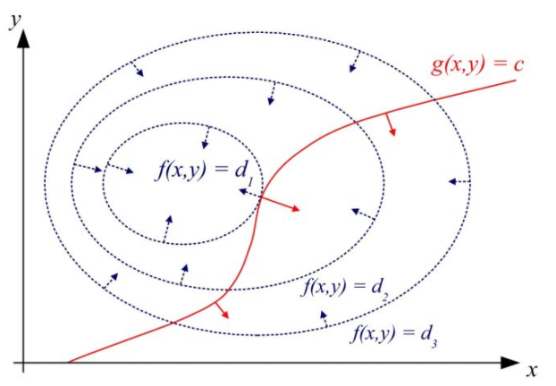
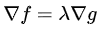

## 拉格朗日乘数
### 定义
在数学最优问题中，拉格朗日乘数法是一种寻找变量受一个或多个条件所限制的多元函数的极值的方法。
该方法将一个有n个变量与k个约束条件的最优化问题转换为一个有n + k个变量的方程组的极值问题，其变量不受任何约束。  
### 原理  
求函数z=f(x,y)在满足φ(x,y)=0下的条件极值，可以转化为拉格朗日函数F(x,y,λ)=f(x,y)+λφ(x,y)的无条件极值问题。
即求其一阶倒数为0的点就为极值点(分别对x、y、λ求偏导等于0解出x、y、λ)。  
  
红线标出的是约束g(x,y)=c的点的轨迹，蓝线是f(x,y)的等高线，箭头表示法向量。
当约束曲线g=c与某一条等高线f=d1相切时，函数f取得极值，两曲线相切等价于两曲线在切点处拥有共线的法向量，
因此可得函数f(x,y)与g(x,y)在切点处的梯度成正比，即  
所以其几何解释为：在极值点一定存在一个λ值使得其梯度和为0。