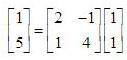

## 矩阵相关计算
### 点积和投影
两个向量的点积定义如下：  
  
两个向量点积的几何意义为：  
一个向量a在另一个向量b方向上的分量的长度，和b的长度相乘得到的值，其中a在b上的分量就是的长度就是a在b上的投影  
  
两个向量的夹角的cos值是两个向量的相似性的重要度量  
  

### 矩阵的乘法
* 投影角度的理解  
矩阵乘以一个向量的计算，事实上就是矩阵每一行的行向量和待乘向量的点积所形成的新的向量  
  
* 坐标映射角度的理解  
假设矩阵乘法:  
  
画出所有的列向量:  
  
将其理解为通过一个变换矩阵对向量进行了一个线性变换，其实也就是仿射变换  
对于第i维度的单元向量，变换后对应的就是变换矩阵中的第i列的列向量  
进一步理解就是将单位向量([1, 0], [0, 1])和变换矩阵对应维度的列向量([2, 1], [-1, 4])的反应出来的映射关系
应用到和变换矩阵相乘的向量([1, 1])上  

### 本征向量和本征值
如果向量v与变换矩阵A满足Av=λv，则称向量v是变换矩阵A的一个特征向量，λ是相应的特征值  
结合矩阵乘法坐标映射角度的理解，一个向量和一个变换矩阵的乘积会将该向量沿着变换矩阵的本征向量的方向上进行缩放，
缩放的倍数就是本征向量对应的本征值  

### 正定矩阵
定义: 对于任意非零的向量x, 和一个对称矩阵A, 如果满足, 则A为正定矩阵  
正定矩阵的特征向量是正交的，也就是说经过一个正定矩阵变换的向量沿着其本征向量方向进行缩放且这些向量是正交的  

### 奇异值分解(SVD)
对于以上正定矩阵的沿着特征向量缩放的描述难以直观想象，那么可以将这种变换过程理解为三个阶段:  
* 把原空间中对对应的特征向量旋转到标准空间下(例如，旋转回x, y轴，都是正交的)
* 在标准空间下进行缩放  
* 再旋转回原空间中  

于是我们可以将一个变换矩阵分解为如下形式:  
  
其中U和V均为单位正交阵，即有UUT=I和VVT=I，U称为左奇异矩阵，V称为右奇异矩阵  
Σ仅在主对角线上有值，也就是奇异值，其它元素均为0  
对于正定矩阵，上式的V=U