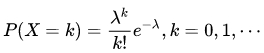
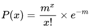
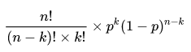
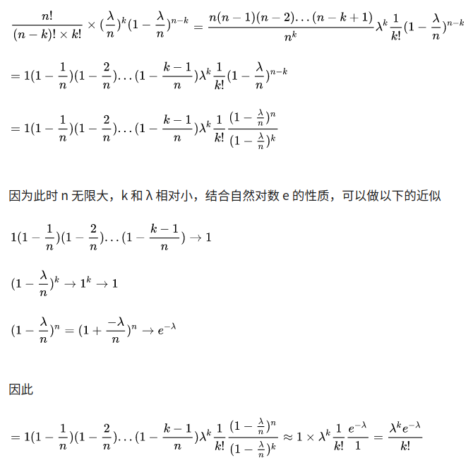

## 泊松分布
### 定义
泊松分布的概率函数为：  
  
其意义在于观察事物平均发生m次的条件下，实际发生x次的概率P（x）可用下式表示：  
  
### 证明
二项分布的概率函数为B(n, p)：  
  
泊松分布是二项分布的极限形式，若将平均发生m次的时间划分程更小的单位时间n份，总有一个n满足单位时间只发生一次事件,
则单位时间发生事件的概率与1/n成正比，则我们用λ/n表示，划分成n份后的新的概率函数满足二项分布B(n, λ/n),将n取
无穷大极限即可得到泊松分布  
