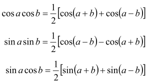
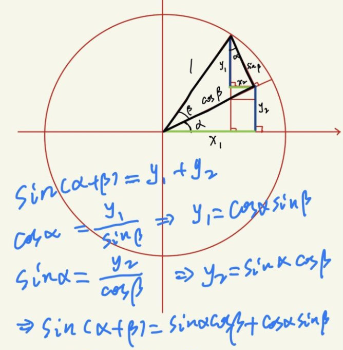
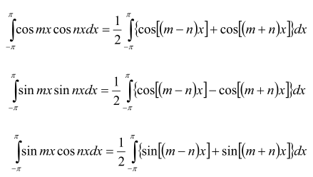
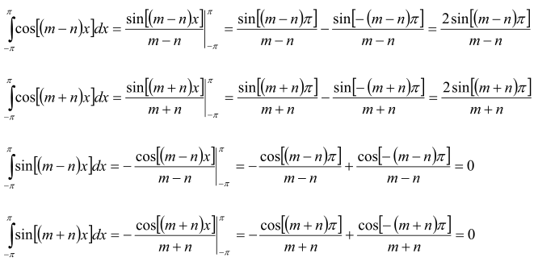
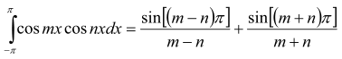
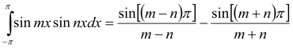
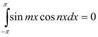
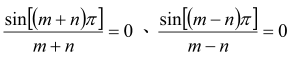
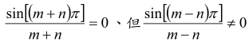
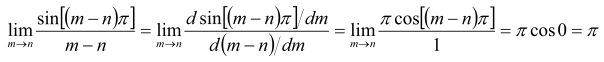

## 三角函数
### 三角函数和差化积公式
  
再做变换可以得到：  
  
其证明过程如下：  
  
同理可以得到cos(α+β)=x1-x2  
将β替换为-β则可以得到剩下的两个式子sin(α-β)、cos(α-β)  
### 正交性  
  
其证明过程如下：  
根据三角函数的和差化积公式可以将上式变换为  
  
其中  
  
再带入上式可得  
  
  
  

当m!=n时  
  

当m==n时  
  
  
以上合并得到三角函数的正交公式