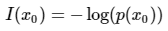
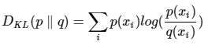

## 熵
### 信息量
信息量来衡量一个事件的不确定性，一个事件发生的概率越大，不确定性越小，则其携带的信息量就越小  
  
### 熵
熵用来衡量一个系统的混乱程度，代表系统中信息量的总和；熵值越大，表明这个系统的不确定性就越大  
  
### 交叉熵
交叉熵使用分布q(x)表示目标分布p(x)的困难程度  
  
### 相对熵（KL散度）
相对熵表示同一个随机变量的两个不同分布间的距离  
  
熵、交叉熵、相对熵的转换公式为：  
  
