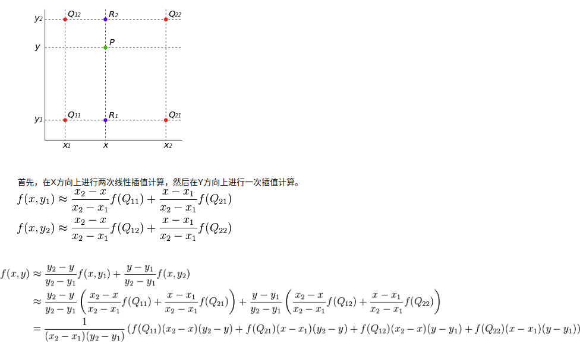

## 插值
### 双线性插值
双线性插值是有两个变量的插值函数的线性插值扩展，其核心思想是在两个方向分别进行一次线性插值。  
#### 计算方法
  
其中f(x, y1)为f(R1)，f(x, y2)为f(R2)  
其中f(R1)的等式可以通过几何中的等比关系得到  
```
(x2-x)/(x2-x1) = (f(Q21)-f(R1))/(f(Q21)-f(Q11))
```
解等式即可得到上式的f(x, y1)，同理此等式再被使用了两次来计算f(x, y2)和f(x,y)  
f(x, y)将常数项替换即可得出等式：  
```
f(x, y) = Ax + By + Cxy + D
```
其中存在四个未知数，通过几个约束点解出未知数即可得到插值的等式