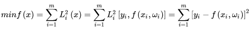

## 最小二乘法
### 定义
最小二乘法通过最小化误差的平方和寻找数据的最佳函数匹配。  
  
### 求解
求解思路为取最小值的解在倒数为0的地方，所以针对每个参数求倒并取值为0得到多个求解方程再分别解出参数的值。
### 代码示例
[code](https://nbviewer.jupyter.org/github/wan-h/Brainpower/blob/master/Code/Math/OrdinaryLeastSquares.ipynb)