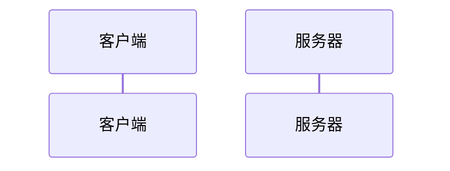
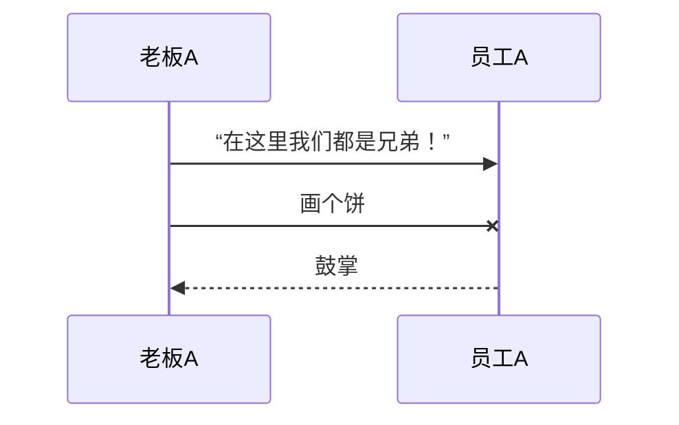
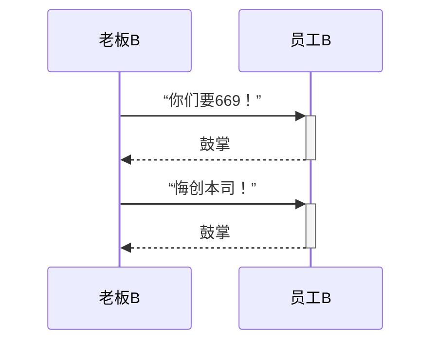
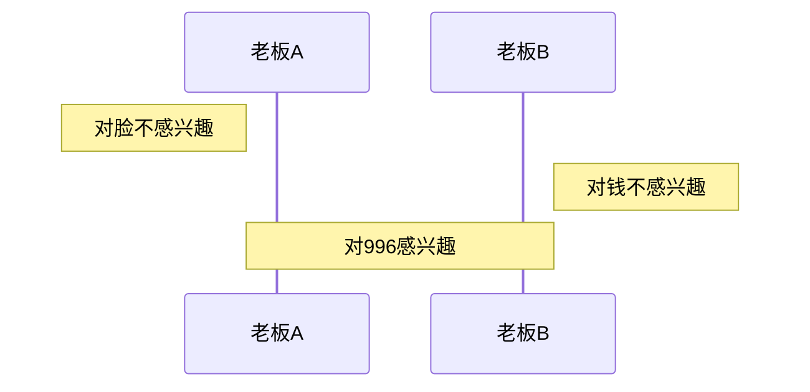
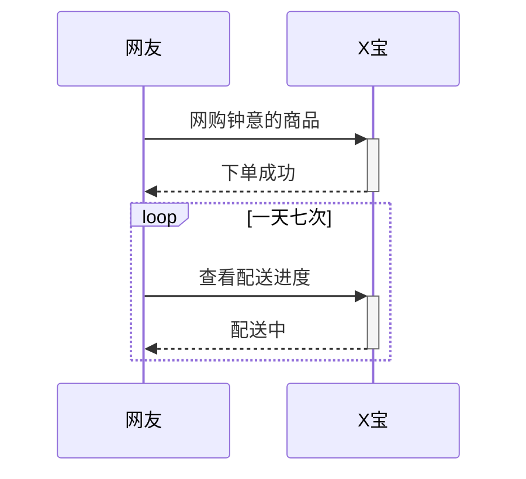
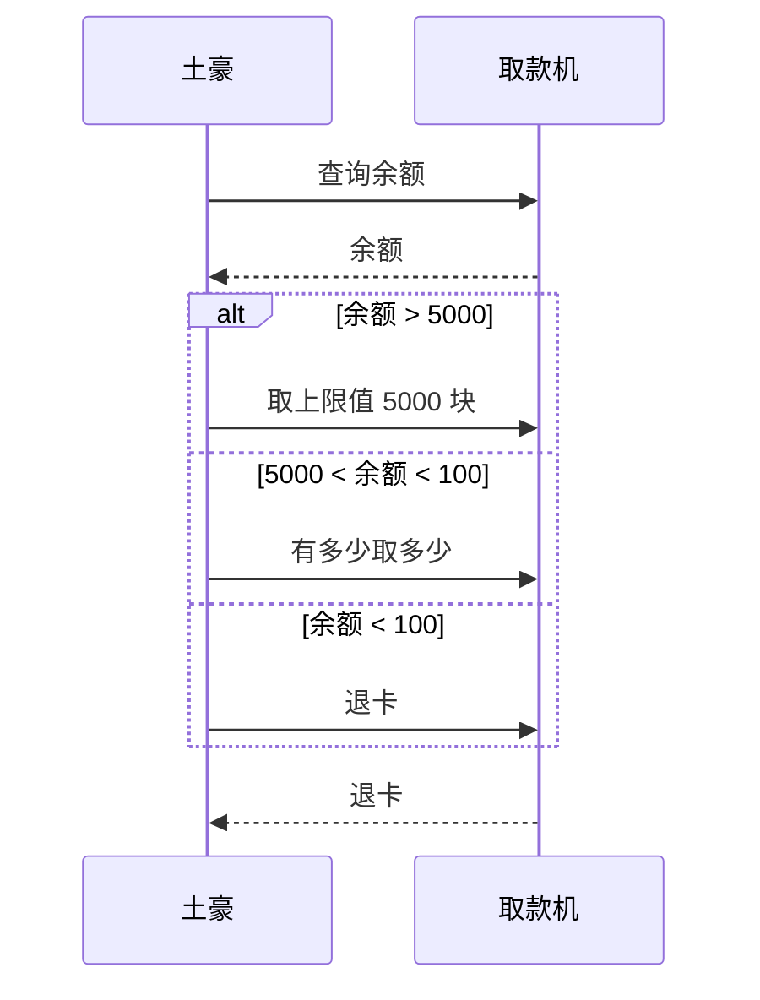
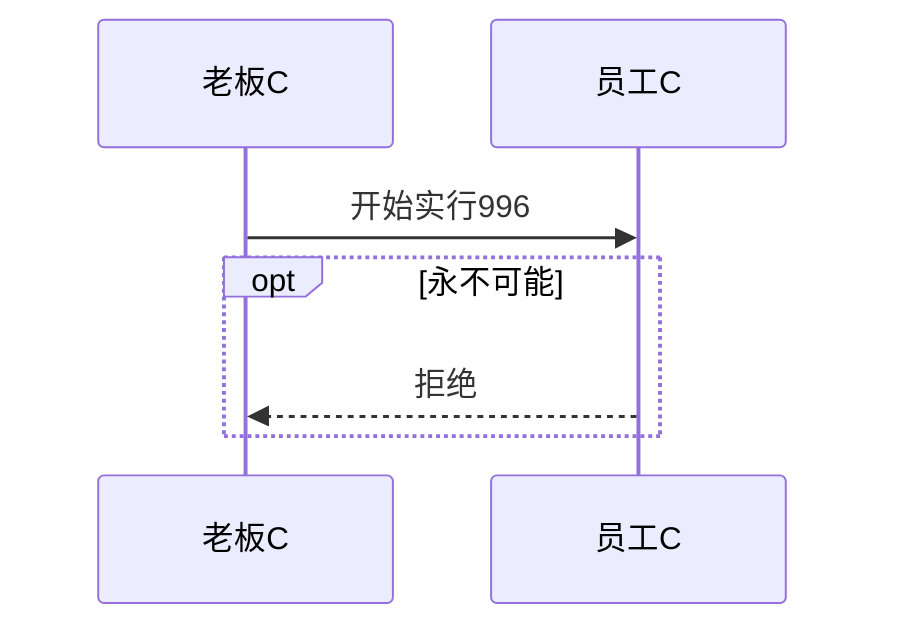
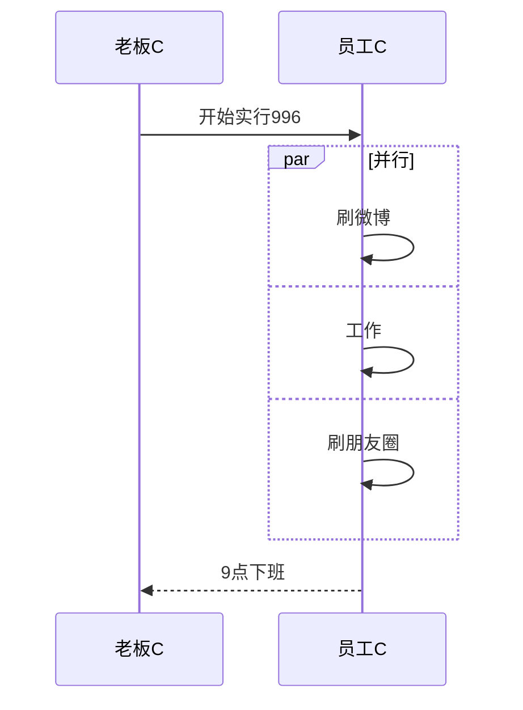

## Grammar

### 时序图
#### 参与者

```mermaid
sequenceDiagram
    participant 客户端
    participant 服务器
```
#### 消息

```mermaid
sequenceDiagram
    participant 老板A
    participant 员工A

    老板A ->> 员工A : “在这里我们都是兄弟！”
    老板A -x 员工A : 画个饼
    员工A -->> 老板A : 鼓掌
```
#### 激活框

```mermaid
sequenceDiagram
    老板B ->> + 员工B : “你们要669！”
    员工B -->> - 老板B : 鼓掌
    
    老板B ->> + 员工B : “悔创本司！”
    员工B -->> - 老板B : 鼓掌
```
#### 注解

```mermaid
sequenceDiagram
    Note left of 老板A : 对脸不感兴趣
    Note right of 老板B : 对钱不感兴趣
    Note over 老板A,老板B : 对996感兴趣
```
#### 循环

```mermaid
sequenceDiagram
    网友 ->> + X宝 : 网购钟意的商品
    X宝 -->> - 网友 : 下单成功
    
    loop 一天七次
        网友 ->> + X宝 : 查看配送进度
        X宝 -->> - 网友 : 配送中
    end
```
#### 选择

```mermaid
sequenceDiagram
    土豪 ->> 取款机 : 查询余额
    取款机 -->> 土豪 : 余额
    
    alt 余额 > 5000
        土豪 ->> 取款机 : 取上限值 5000 块
    else 5000 < 余额 < 100
        土豪 ->> 取款机 : 有多少取多少
    else 余额 < 100
        土豪 ->> 取款机 : 退卡
    end
    
    取款机 -->> 土豪 : 退卡
```
#### 可选

```mermaid
sequenceDiagram
    老板C ->> 员工C : 开始实行996
    
    opt 永不可能
        员工C -->> 老板C : 拒绝
    end
```
#### 并行

```mermaid
sequenceDiagram
    老板C ->> 员工C : 开始实行996
    
    par 并行
        员工C ->> 员工C : 刷微博
    and
        员工C ->> 员工C : 工作
    and
        员工C ->> 员工C : 刷朋友圈
    end
    
    员工C -->> 老板C : 9点下班
```