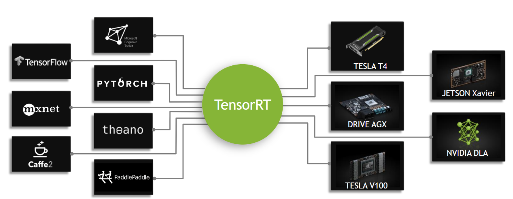

## tensorRT
[Link](https://docs.nvidia.com/deeplearning/sdk/tensorrt-developer-guide/index.html)  
[Insight](https://zhuanlan.zhihu.com/p/35657027)  

---
### OVERVIEW  
tensorRT是专门针对GPU前向做的加速引擎，当前提供c++和Python接口。  
常用的深度学习框架需要在灵活和性能之间做一个权衡，所以往往对于前向没有做任何优化，
而tensorRT就专门针对网络的前向做了系列优化，以此满足实际场景中对速度的需求。  
理论上tensorRT可以带来10x到100x的加速。

---
### STRUCTURE  

